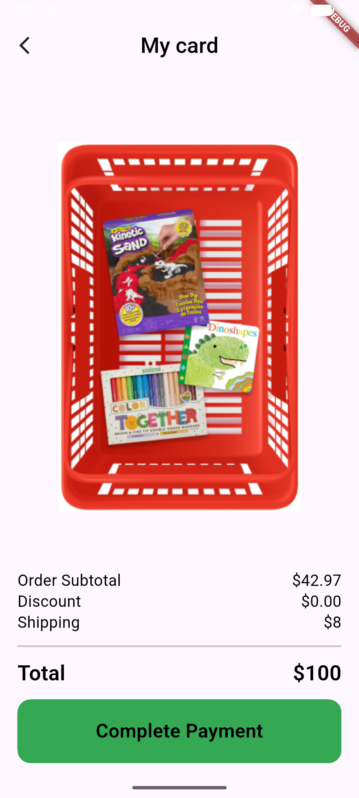
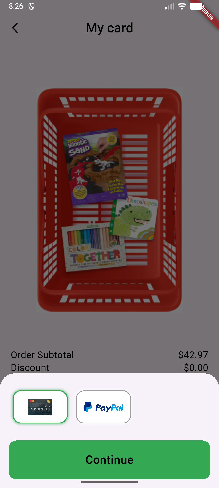
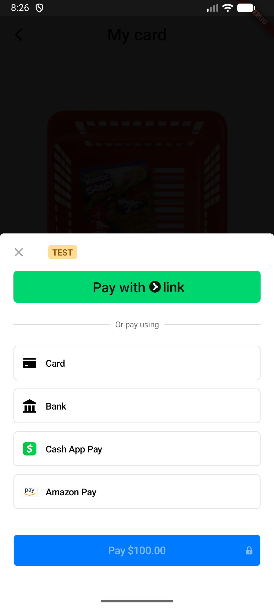
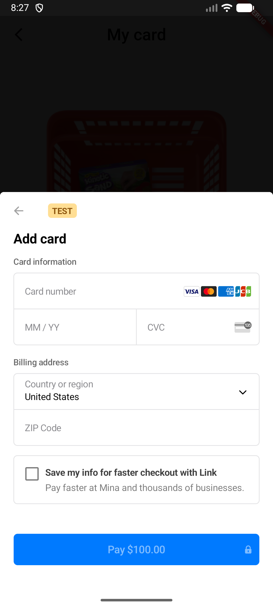

# Checkout Payment App using Stripe 💳

A modern Flutter application that demonstrates a secure and scalable checkout/payment flow using **Stripe** integration, clean architecture principles, and state management with Bloc/Cubit.

---

# 🚀 Features

* Secure payment flow using Stripe
* Clean and responsive UI
* State management using Bloc/Cubit
* API integration
* Error handling and loading states
* Scalable and maintainable project structure
* Reusable widgets and components

---

# 🛠 Tech Stack

* Flutter
* Dart
* Stripe API
* Bloc / Cubit
* REST API
* Clean Architecture

---

# 📂 Project Structure

```bash
lib/
│
├── core/
│
├── features/
│   └── checkout/
│       ├── data/
│       ├── domain/
│       └── presentation/
│
├── main.dart
```

---

## 📸 Screenshots

### Home Screen


### Payment Method Screen


### payment Stripe Screen


### Payment Screen


### Checkout Screen


### Payment Success


---

# ▶ Getting Started

## Prerequisites

Make sure you have installed:

* Flutter SDK
* Android Studio or VS Code
* Android Emulator or Physical Device

---

# ⚙ Installation

Clone the repository:

```bash
git clone https://github.com/Mina8496/checkout_payment.git
```

Navigate to the project folder:

```bash
cd checkout_payment
```

Install dependencies:

```bash
flutter pub get
```

Run the application:

```bash
flutter run
```

---

# 🔑 Stripe Configuration

Add your Stripe Secret Key and Publishable Key inside your configuration files.

Example:

```dart
const String publishableKey = "YOUR_PUBLISHABLE_KEY";
const String secretKey = "YOUR_SECRET_KEY";
```

⚠ Never expose your secret key in production apps.

---

# 📚 What I Learned

This project helped me improve my knowledge in:

* Payment Gateway Integration
* Stripe API
* Clean Architecture
* Flutter State Management
* API Handling
* Error Management
* Building scalable Flutter applications

---

# 🤝 Contributing

Contributions, issues, and feature requests are welcome.

Feel free to fork this repository and submit pull requests.

---

# 📧 Contact

GitHub:
https://github.com/Mina8496

LinkedIn:
Add your LinkedIn profile here.

---

# ⭐ Support

If you like this project, don't forget to give it a star ⭐
